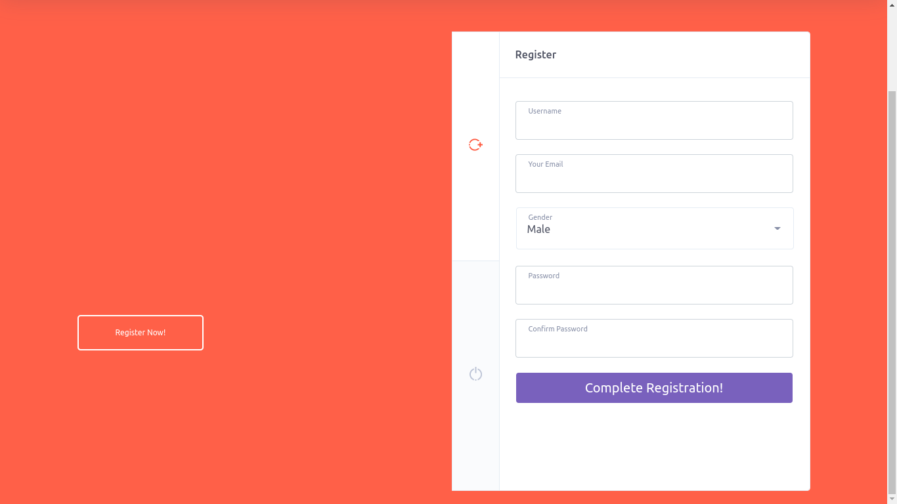
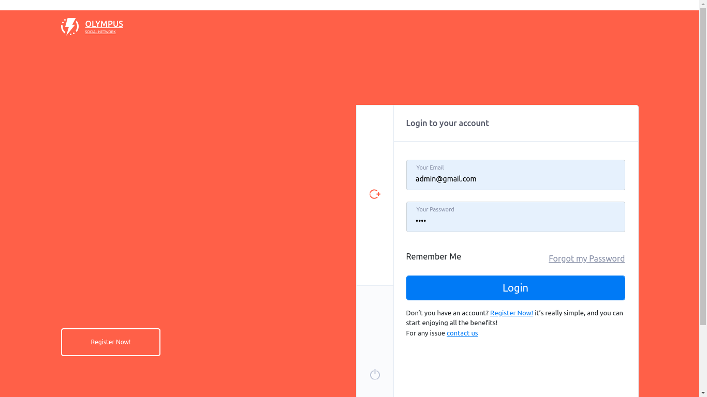
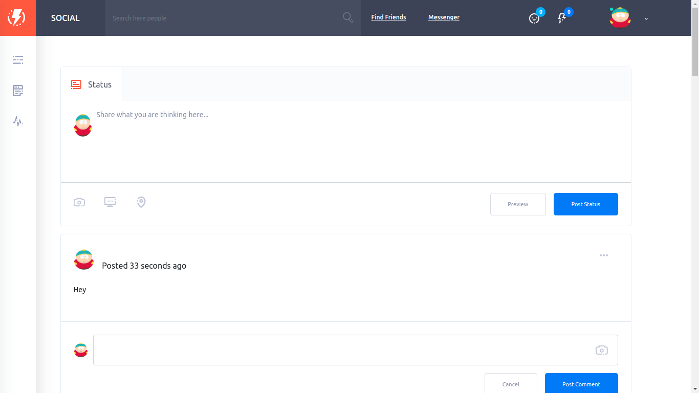
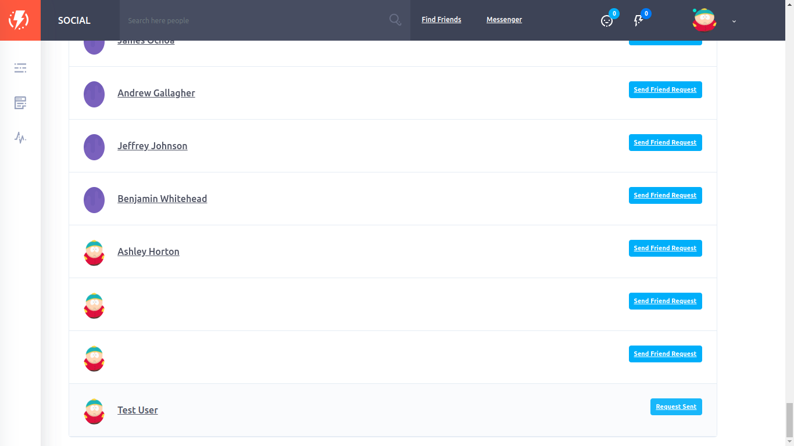
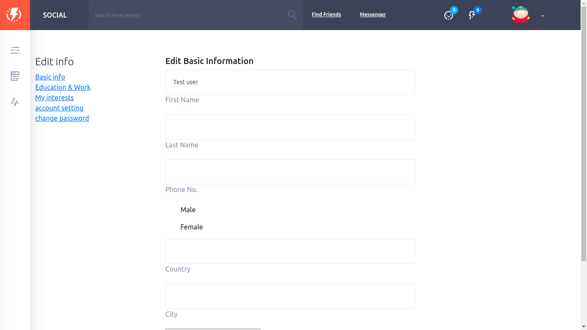
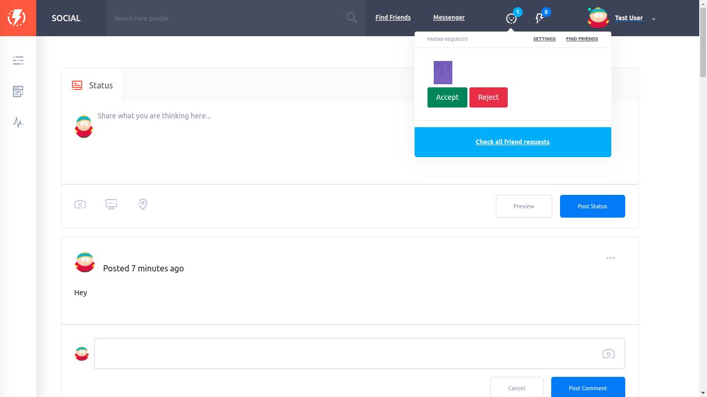
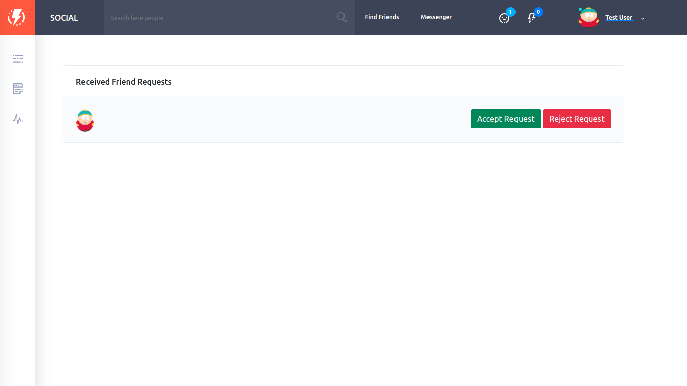
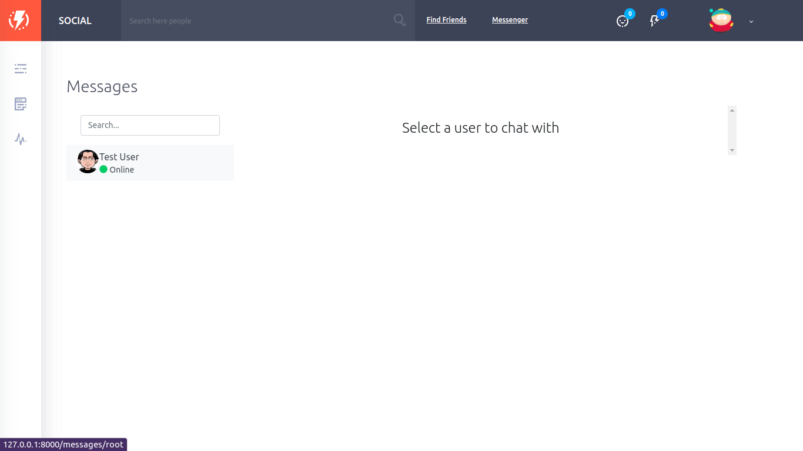
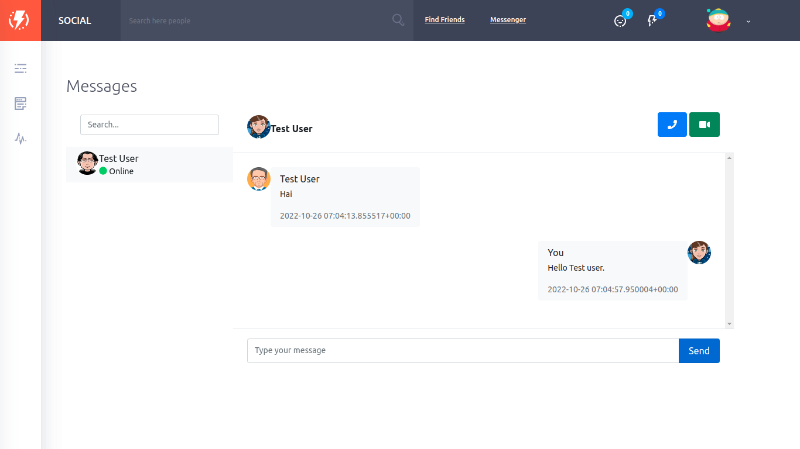

# Django Social Network

A Django 4.0 -based open source social network application.
## Badges
[](https://github.com/manjurulhoque/django-social-network/blob/master/LICENSE)
[](https://github.com/manjurulhoque/django-social-network/issues)
[](https://github.com/manjurulhoque/django-social-network/fork)
[](https://github.com/manjurulhoque/django-social-network)
[](https://img.shields.io/twitter/url?url=https%3A%2F%2Fgithub.com%2Fmanjurulhoque%2Fdjango-social-network
)


## Features

- Login/Register as a user.
- Create posts and comment on the particular post.
- Receive notification when someone comment on your post.
- Send friend request and accept request.
- Live chat with friends.


## Installation
1. Clone or download this repository and open it in your editor of choice: 
```bash
git clone https://github.com/manjurulhoque/django-social-network.git
```
2. cd into project repository.
```bash
 cd django-social-network
 ``` 
3. To get this project up and running you should start by having Python installed on your computer. It's advised you create a virtual environment to store your projects dependencies separately. You can install virtualenv with

```bash
sudo apt install python3-venv
```
4. Within the directory run the following command to create your new virtual environment:
```bash
python3 -m venv my-project-env
```
The command above creates a directory called my-project-env, which contains a copy of the Python binary, the Pip package manager, the standard Python library and other supporting files.

5. To start using this virtual environment, you need to activate it by running the activate script:
```bash
source my-project-env/bin/activate.
```
Once activated, the virtual environment’s bin directory will be added at the beginning of the $PATH variable. Also your shell’s prompt will change and it will show the name of the virtual environment you’re currently using. In our case that is 
```bash 
(my-project-env) $
```
Now that the virtual environment is activated, we can start installing, upgrading, and removing packages using pip.

6. The first step is to install the module,using the Python package manager, pip:
```bash
pip -r install requirements.txt
```
Modify `django-social-network/setting.py` with database settings if you want to connect database other than default sqlite db.


7. Run the following commands in the root folder.
```bash
python manage.py makemigrations
python manage.py migrate
```
8. Also create a superuser by :
```bash
python manage.py createsuperuser
```
9. To get start runserver localy by:
```bash
python manage.py runserver
```
Open up a browser and visit: http://127.0.0.1:8000/ , then you will see the application.
## Screenshots






## Contributing

Contributions are always welcome!

See `contributing.md` for ways to get started.

Please adhere to this project's `code of conduct`.

## Support
Show your support by 🌟 the project!!

