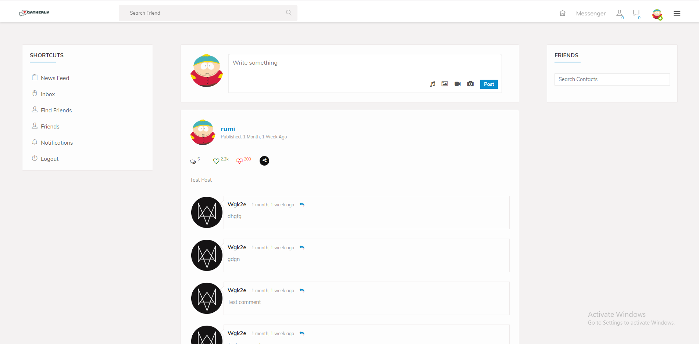
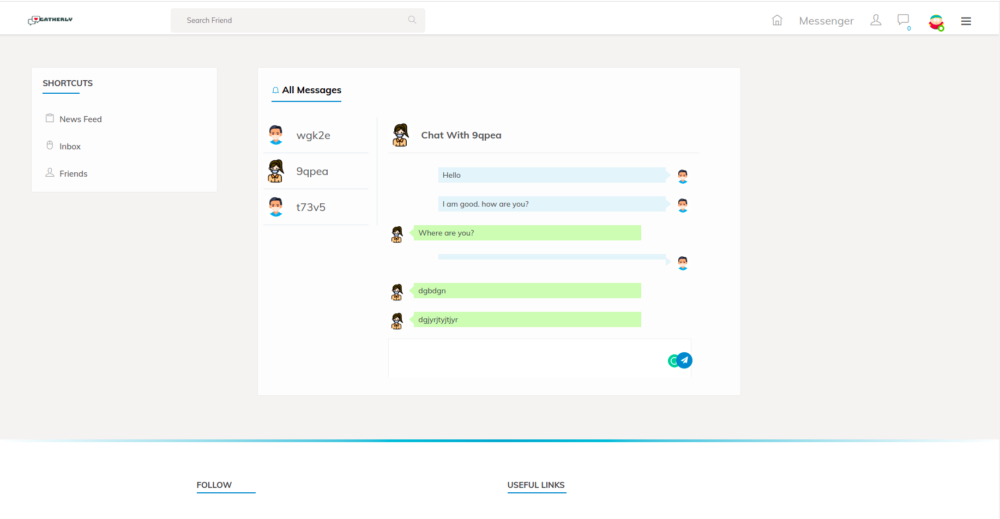
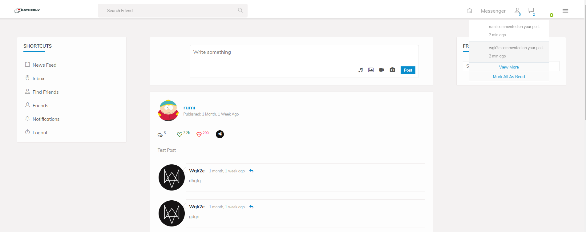

## Django Social Network

#### An open source Social Network

Used Tech Stack

1. Django
2. Sqlite
3. Web Socket (Django Channel)

Current Features:

1. Login/Register
2. Create post and comment on the particular post
3. Receive notification when someone comment on your post
4. Send friend request and accept request
5. Live chat with friends

### Screenshots

## Home page

## Live Chatting

## Notification

Show your support by 🌟 the project!!
